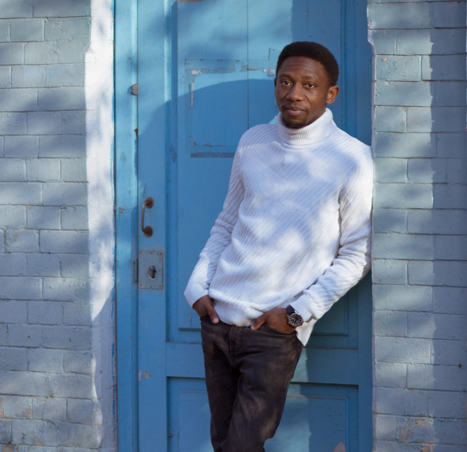

# Introdcution

Hello, My name is Allan Chisakula, i speak 3 languages namely English, Russian
and Ukrainian. i'm currently learning french and i hope to become fluent, as i
have always liked it. and living in belgium will make that desire possible.

## Hobbies and intrestes

During my free time i like to:

- Draw
- Read (I like read alot and almost anything that seems intresting)
- Writing poems
- Travelling
- Playing an instrument (Im currenlty learning the guitar)
- Play video games
- Travelling

### Others

I have always had an intrest in creative designs, be it architecture, wed
designs/Development but never got the chance to learn any of them. in Hack your
future i have this possibility to learn web development and put everything into
practice

